<div align="center">

# My Tesla → Insurance-Grade Risk Score

**One car. Real telemetry. Transparent ML. Running on AWS for ~$12/month.**

[](https://github.com/saranreddy/tesla-driving-data-mlops/actions)
[](https://aws.amazon.com)
[](https://www.terraform.io)
[](https://www.python.org)
[](LICENSE)

*Capturing every drive from my Model S 100D, checking data quality, extracting features, and computing transparent insurance risk scores — all while learning AWS, Terraform, and MLOps.*

[What It Does](#the-story) • [Real Drive Data](#what-one-real-drive-looks-like) • [Architecture](#architecture) • [Get Started](#quick-start) • [Roadmap](#roadmap)

</div>

---

## 🎯 The Story

I wanted to understand my Tesla's data and learn whether *my* driving would get better or worse insurance rates. Instead of sending data to a black-box telematics app, I built this:

1. **Capture:** TeslaMate streams real-time telemetry from my car (GPS, speed, power, battery, climate — every second)
2. **Store:** PostgreSQL database on a tiny EC2 instance ($8/mo) with nightly S3 exports
3. **Quality Check:** Catch bad data (wrong energy calculations, impossible jumps, too-short trips)  
4. **Extract Features:** Hard braking, speeding, night driving, highway miles — insurance-relevant behaviors
5. **Score Transparently:** 0-100 risk score with *configurable weights I control*, not a proprietary algorithm

**Result:** I can query Athena to see my risk score per trip, investigate what made a trip "risky," and know exactly why (because the model is mine, not hidden).

---

## 🚗 What One Real Drive Looks Like

My first complete export: **October 9, 2026, 2:09 PM CT**

```
📍 40.4 km round trip (likely highway commute)
⏱️  43 minutes
🔋 Battery: 77% → 68% (9% drop, ~9 kWh used)
🌡️  Outside temp: 33°C (hot Texas day)
⚡ Max speed: 127 km/h (~79 mph)
📊 2,580 one-second position readings captured
```

**What the data showed:**

| Layer | What Happened |
|-------|---------------|
| **Bronze** | Export succeeded. But `kwh_used` = 43.58 — that's *kilometers* of range lost, not kWh! |
| **Bug Caught** | Energy calculation was `start_range - end_range` instead of `(start_range - end_range) × car_efficiency`. Fixed in [PR #4](https://github.com/saranreddy/tesla-driving-data-mlops/pull/4). |
| **Silver** | *Quality checks will run once deployed.* Expected: energy plausible (8-9 kWh ≈ 9% battery drop), efficiency ~200 Wh/km (highway), trip long enough, odometer matches. |
| **Gold (Features)** | *Features will be extracted once deployed.* Will capture: hard braking events, speeding time, night driving, highway %. |
| **Gold (Score)** | *Risk score will be computed from `ins_trip_scores` table once deployed.* The transparent model will show exactly why the score is what it is. |

**The Plan:** After deployment, query `teslamate_insurance.ins_trip_scores WHERE date = '2026-10-09'` to see the actual risk score and top factors.

---

## 🐛 Bugs Real Data Caught

[Issue #11: Real-world data quality failures](https://github.com/saranreddy/tesla-driving-data-mlops/issues/11)

On that first drive, the data exposed **five real bugs** that would've silently corrupted analysis:

1. ❌ **Wrong column names:** Export queried `start_ideal_battery_range_km` (doesn't exist). Battery % is in `positions` table, joined via `start_position_id`.
2. ❌ **Type mismatch:** `speed_max` written as INT64, Glue expected double. Athena failed with `HIVE_BAD_DATA`.
3. ❌ **Energy as distance:** `kwh_used` held km of range lost (43.58), not kWh. Efficiency = 1079 Wh/km (nonsense).
4. ⚠️ **Sparse fields:** Range and temp only populated every ~10 readings. Silver layer now forward-fills within trips.
5. ⚠️ **Silent failures:** Export crashed but systemd logged it as "done." Silver layer now writes run status.

**Every issue is now a silver-layer check**, so it can't happen again silently.

---

## 🏗️ Architecture

```mermaid
flowchart LR
    Car["🚗 Model S 100D<br/>(real telemetry)"]
    Stream["📡 Tesla API<br/>(streaming)"]
    TM["TeslaMate<br/>(Docker)"]
    PG["PostgreSQL<br/>(EC2)"]
    
    Bronze["🥉 Bronze Layer<br/>drives | charges | positions<br/>(raw S3 Parquet)"]
    Silver["🥈 Silver Layer<br/>quality checks | forward-fill<br/>(cleaned data)"]
    Gold["🥇 Gold Layer<br/>features | risk scores<br/>(insurance ML)"]
    
    Glue["AWS Glue Catalog<br/>(3 databases, 8 tables)"]
    Athena["Amazon Athena<br/>(SQL queries)"]
    Insights["📊 Insights<br/>(risk per trip)"]
    
    Car -->|"every 1-10s"| Stream
    Stream --> TM
    TM --> PG
    PG -->|"nightly 9PM CT"| Bronze
    Bronze -->|"quality checks"| Silver
    Silver -->|"feature extraction"| Gold
    
    Bronze --> Glue
    Silver --> Glue
    Gold --> Glue
    Glue --> Athena
    Athena --> Insights
    
    style Car fill:#e82127,stroke:#cc0000,stroke-width:2px,color:#fff
    style Bronze fill:#cd7f32,stroke:#8B4513,stroke-width:2px,color:#fff
    style Silver fill:#C0C0C0,stroke:#808080,stroke-width:2px,color:#000
    style Gold fill:#FFD700,stroke:#DAA520,stroke-width:2px,color:#000
    style Insights fill:#00ff88,stroke:#00cc6a,stroke-width:2px,color:#000
```



### The Medallion Pattern

| Layer | What | Why |
|-------|------|-----|
| 🥉 **Bronze** | Raw exports from TeslaMate Postgres | Preserves source data, idempotent, backward compatible |
| 🥈 **Silver** | Quality-checked, forward-filled | Flags bad trips, fills sparse fields, auditable |
| 🥇 **Gold** | Use-case specific (insurance scoring) | Ready for ML, transparent model, query-optimized |

---

## 💡 Real vs. Planned

**What's Live:**
- ✅ TeslaMate capturing my real Model S data since October 2026
- ✅ Nightly Parquet exports to S3 (drives, charges) — bronze layer working
- ✅ Athena queries work, costs ~$12/month (estimate)

**What's Built, Deploying:**
- 🔨 Bronze/silver/gold medallion layers (code ready, PR #12)
- 🔨 Quality checks from issue #11 (silver layer)
- 🔨 Insurance risk scoring (gold layer)
- 🔨 Positions export (1-second GPS readings)

**What's Planned:**
- 🔨 Full unit test coverage (silver checks, gold features)
- 🔨 Grafana dashboards (risk trends over time)
- 🔨 Automated deployment (`user_data.sh` embedding)

**What's Planned (see [Roadmap](#roadmap)):**
- 📋 ML accident prediction model
- 📋 Weather integration (rain/snow penalties)
- 📋 Comparative scoring (vs fleet average)
- 📋 Real-time alerts (risky driving notifications)

---

## 🚀 Quick Start

<details>
<summary><b>Prerequisites</b></summary>

- AWS account with admin access
- Terraform 1.0+
- A Tesla vehicle with active connectivity
- ~$12/month budget (EC2 t4g.micro + S3 + Athena)

</details>

<details>
<summary><b>1. Clone and Configure</b></summary>

```bash
git clone https://github.com/saranreddy/tesla-driving-data-mlops.git
cd tesla-driving-data-mlops/teslamate_platform/infra

# Copy and customize variables
cp terraform.tfvars.example terraform.tfvars
# Edit terraform.tfvars with your:
# - project_name (no underscores, lowercase)
# - key_name (your EC2 SSH key pair)
# - allowed_cidr_blocks (your IP for SSH access)
```

</details>

<details>
<summary><b>2. Deploy Infrastructure</b></summary>

```bash
cd teslamate_platform/infra
terraform init
terraform plan    # Review: 1 EC2, 1 S3 bucket, 3 Glue databases, 8 tables, IAM, security
terraform apply

# Save outputs
INSTANCE_ID=$(terraform output -raw instance_id)
BUCKET=$(terraform output -raw s3_bucket_name)
PUBLIC_IP=$(terraform output -raw instance_public_ip)
```

**What gets created:**
- t4g.micro EC2 (Graviton, 1GB RAM, 2GB swap, ~$8/mo)
- TeslaMate + Grafana + Mosquitto (Docker Compose)
- PostgreSQL 17 (tuned for 1GB instance)
- S3 bucket (data + Athena results, ~$2/mo)
- Glue databases: `teslamate_bronze`, `teslamate_silver`, `teslamate_insurance`
- Nightly export systemd timer (9 PM CT)

</details>

<details>
<summary><b>3. Configure TeslaMate</b></summary>

```bash
# Open TeslaMate in browser
echo "http://$PUBLIC_IP:4000"

# Follow wizard:
# 1. Sign in with your Tesla credentials
# 2. Select your vehicle
# 3. Set timezone (US/Central)
# 4. TeslaMate will start capturing data immediately
```

**Note:** TeslaMate stores your Tesla tokens encrypted. Credentials never leave your EC2 instance.

</details>

<details>
<summary><b>4. Verify Data Pipeline</b></summary>

```bash
# Wait for first drive (or trigger manually: systemctl start teslamate-export)

# Check bronze export worked
aws s3 ls s3://$BUCKET/bronze/drives/date=$(date -u +%Y-%m-%d)/ --region us-east-1

# Query in Athena (AWS Console or CLI)
aws athena start-query-execution \
  --query-string "SELECT COUNT(*) as drives FROM teslamate_bronze.drives WHERE date = '$(date -u +%Y-%m-%d)'" \
  --query-execution-context Database=teslamate_bronze \
  --result-configuration OutputLocation=s3://$BUCKET/athena-results/ \
  --region us-east-1
```

</details>

<details>
<summary><b>5. Deploy Medallion Layers (Hot-Patch)</b></summary>

See [PR #12](https://github.com/saranreddy/tesla-driving-data-mlops/pull/12) for comprehensive hot-patch instructions to add:
- Silver layer (quality checks)
- Gold layer (insurance features + scoring)
- Systemd timers for nightly processing

**Why hot-patch?** The live instance is already running. Hot-patching deploys the scripts immediately without rebuilding. New instances will require manual setup until `user_data.sh` is updated.

</details>

---

## 📂 Repository Structure

```
tesla-driving-data-mlops/
├── teslamate_platform/          # Shared platform (infra + data layers)
│   ├── infra/                   # Terraform (EC2, S3, Glue, IAM)
│   ├── export/                  # Bronze layer export script
│   ├── silver/                  # Quality checks (issue #11)
│   └── bronze/                  # Layer documentation
├── usecases/                    # Business use cases (add your own!)
│   ├── insurance/               # Risk scoring (gold layer)
│   │   ├── gold/                # Features + scoring scripts
│   │   └── README.md            # Insurance use case docs
│   └── _template/               # Template for new use cases
├── tests/                       # Unit tests
├── docs/                        # Documentation + diagrams
└── .github/workflows/           # CI (pytest, terraform validate, linting)
```

**Modular Design:** Add new use cases (predictive maintenance, route optimization, energy forecasting) in `usecases/` without touching the platform.

---

## 🗺️ Roadmap

### ✅ Live in Production
- [x] TeslaMate on EC2 (capturing real data)
- [x] Nightly S3 exports (Parquet, drives + charges)
- [x] Glue + Athena (query-ready)
- [x] Energy calculation fix ([#4](https://github.com/saranreddy/tesla-driving-data-mlops/pull/4))

### 🔨 Built, Ready to Deploy
- [x] Modular repo layout ([#3](https://github.com/saranreddy/tesla-driving-data-mlops/pull/3))
- [x] Bronze/silver/gold medallion layers ([#12](https://github.com/saranreddy/tesla-driving-data-mlops/pull/12))
- [x] Quality checks from [#11](https://github.com/saranreddy/tesla-driving-data-mlops/issues/11)
- [x] Insurance risk scoring (transparent 0-100)
- [x] Positions export (1-second GPS readings)

### 🔨 In Progress
- [ ] Deploy medallion layers to live instance
- [ ] Comprehensive unit tests (silver checks, gold features)
- [ ] Grafana dashboards (risk trends, monthly summary)
- [ ] Embed medallion scripts in `user_data.sh` (automated deployment)

### 📋 Planned
- [ ] **ML Model:** Accident prediction from driving features ([#5](https://github.com/saranreddy/tesla-driving-data-mlops/issues/5))
- [ ] **Weather Integration:** Fetch weather at trip time/location, add rain/snow penalties ([#6](https://github.com/saranreddy/tesla-driving-data-mlops/issues/6))
- [ ] **Comparative Scoring:** My risk vs. fleet average percentile ([#7](https://github.com/saranreddy/tesla-driving-data-mlops/issues/7))
- [ ] **Real-time Alerts:** SMS/email when risky behavior detected ([#8](https://github.com/saranreddy/tesla-driving-data-mlops/issues/8))
- [ ] **SageMaker Integration:** Train models on historical data ([#9](https://github.com/saranreddy/tesla-driving-data-mlops/issues/9))
- [ ] **Multi-vehicle:** Support fleet of Teslas with comparative analysis ([#10](https://github.com/saranreddy/tesla-driving-data-mlops/issues/10))

---

## 💰 Cost Breakdown

**Estimated monthly spend:** ~$12, mostly the t4g.micro instance

The bulk is the EC2 t4g.micro running 24×7 (~$6-8/month depending on region). Additional costs: EBS storage for the OS and database, S3 for Parquet files (minimal — a few GB), and Athena queries (pennies per query). Glue Catalog is in the free tier.

**No actual AWS bill yet** — this is an estimate based on AWS pricing. Will update with real costs after the first full month of operation.

---

## 🛠️ Tech Stack

**Infrastructure:** Terraform, AWS (EC2, S3, Glue, Athena, IAM), Docker Compose  
**Data:** TeslaMate (Elixir), PostgreSQL 17, Parquet (PyArrow)  
**Processing:** Python 3.12, pandas, boto3, systemd timers  
**Visualization:** Grafana (live), planned ML dashboards  
**CI/CD:** GitHub Actions (pytest, terraform validate, black, flake8)

---

## 📊 Data Layers Explained

<details>
<summary><b>🥉 Bronze Layer</b> — Raw exports from TeslaMate</summary>

**Location:** `s3://<bucket>/bronze/`  
**Glue Database:** `teslamate_bronze`  
**Tables:** `drives`, `charges`, `positions`

**What it is:** Faithful copy of TeslaMate Postgres with minimal transformation (type casting, timestamp precision). Partitioned by date for efficient querying.

**Key change from original:** Energy calculation fixed to use car efficiency factor (`kwh_used = range_delta × car.efficiency`), not raw range delta.

**See:** `teslamate_platform/bronze/README.md`

</details>

<details>
<summary><b>🥈 Silver Layer</b> — Quality-checked, cleaned data</summary>

**Location:** `s3://<bucket>/silver/`  
**Glue Database:** `teslamate_silver`  
**Tables:** `silver_drives`, `silver_positions`, `silver_run_status`

**What it does:**
- ✅ Energy plausibility (kWh matches battery % drop)
- ✅ Efficiency range (100-500 Wh/km)
- ✅ Trip length (≥1.6 km, ≥2 min)
- ✅ Odometer consistency (±10%)
- ✅ Forward-fill sparse fields (range, temp, climate)
- ✅ Run status tracking (audit trail)

**Output:** Every trip gets `quality_flag` (true/false), `pct_usable` (0-100), and `failure_reasons` (comma-separated).

**See:** `teslamate_platform/silver/README.md`

</details>

<details>
<summary><b>🥇 Gold Layer</b> — Use-case specific (Insurance)</summary>

**Location:** `s3://<bucket>/usecases/insurance/gold/`  
**Glue Database:** `teslamate_insurance`  
**Tables:** `ins_trip_features`, `ins_trip_scores`

**Features extracted:**
- Hard braking/acceleration events per 100 miles
- % time speeding >80 mph
- Night driving minutes (10 PM - 6 AM)
- Highway driving % (sustained >90 km/h)
- Temperature, efficiency

**Risk score (0-100):**
- **Weights:** Hard braking 25%, acceleration 20%, speeding 30%, night 15%, highway bonus -10%
- **Categories:** excellent (0-20), good (21-40), average (41-60), below avg (61-80), poor (81-100)
- **Fully transparent:** Config in `scoring_config.yaml`, assumptions documented

**See:** `usecases/insurance/README.md`

</details>

---

## 🤝 Contributing

This is a personal learning project, but suggestions welcome! Open an issue or PR.

**Areas for contribution:**
- Additional silver quality checks (GPS jumps, impossible acceleration)
- New use cases in `usecases/` (energy optimization, route prediction)
- Cost optimizations (spot instances, S3 lifecycle)
- ML model improvements (better feature engineering)

---

## 📜 License

MIT License - use this however you want.

---

## 👤 About

**Saran Alla**  
📧 saranreddy2002@gmail.com  
🔗 [GitHub](https://github.com/saranreddy)

Built to learn AWS, Terraform, MLOps, and data engineering while understanding my own driving data. Started October 2026 with one Model S 100D in Texas.

**Why I built this:** I was curious if my driving would qualify for "good driver" discounts, but I didn't trust black-box telematics apps. So I built my own transparent system where I control the data, the model, and the scoring logic. Plus, great hands-on practice with AWS data services.

---

<div align="center">

**⭐ If you find this useful, give it a star!**

*Questions? Open an [issue](https://github.com/saranreddy/tesla-driving-data-mlops/issues).*

</div>
