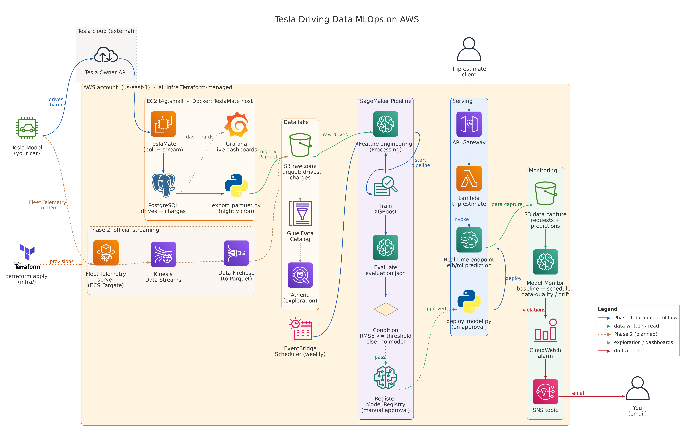

# Tesla Driving Data MLOps

[](https://github.com/saranreddy/tesla-driving-data-mlops/actions/workflows/ci.yml)
[](https://opensource.org/licenses/MIT)
[](https://www.python.org/downloads/)
[](https://www.terraform.io/)

A complete MLOps portfolio project for collecting real Tesla driving data and training ML models to predict energy efficiency (Wh/mi). Built on self-hosted TeslaMate on AWS, provisioned with Terraform, with automated nightly exports to S3 Parquet for machine learning pipelines.

Companion to [sagemaker-mlops-pipeline-starter](https://github.com/saranreddy/sagemaker-mlops-pipeline-starter) and [sagemaker-model-monitor-starter](https://github.com/saranreddy/sagemaker-model-monitor-starter), extending their patterns to real-world personal driving data collection and model deployment.

**Status: Phase 1 Complete** — TeslaMate data collection infrastructure is production-ready. ML pipeline, endpoint deployment, and Model Monitor are planned for future phases as data accumulates.

## Who Should Use This

This starter is for ML engineers or data scientists who want to collect and analyze their own Tesla driving data to build predictive models.

**Good fit when you need:**
- **Reliable, long-term Tesla data collection** without depending on third-party services
- **AWS-native infrastructure** provisioned with Terraform, version-controlled and reproducible
- **Clean Parquet exports** ready for ML pipelines (SageMaker, local training, notebooks)
- **A portfolio project** demonstrating end-to-end MLOps: data collection → training → deployment → monitoring
- **Cost-conscious AWS deployment** using Graviton ARM instances and SSM Session Manager (no bastion/VPN)

**Common in these contexts:**
- ML engineers building portfolio projects with real-world personal data
- Tesla owners interested in energy efficiency, charging optimization, or trip prediction
- Data scientists learning AWS MLOps patterns with a concrete, engaging dataset
- Teams evaluating self-hosted data collection infrastructure before committing to SaaS

**Not a good fit for:**
- Non-Tesla owners (you need a Tesla vehicle and a Tesla account)
- Quick experiments (setup takes ~10 minutes; for one-off analysis, export TeslaMate data manually rather than running 24/7)
- Production fleets or commercial use (this is designed for personal use; scaling to many vehicles requires Fleet Telemetry setup)

**Long-term goal**: After collecting months of driving data, train an XGBoost regression model to predict energy consumption (Wh/mi) from features like distance, speed, temperature, elevation change, and HVAC usage. Deploy the model to a SageMaker endpoint and monitor for seasonal drift with Model Monitor. The ML pipeline (phase 2+) is not yet implemented.

## Features

- **Self-hosted TeslaMate** on AWS EC2 (t3.micro, 1 GB RAM + 2 GB swap, free-tier eligible for all accounts; Ubuntu 24.04 LTS, arm64/x86_64 auto-selected)
- **Secure-by-default infrastructure** with Terraform: no public inbound ports, SSM Session Manager access, encrypted EBS, secrets in SSM Parameter Store
- **Memory-optimized for 1 GB RAM**: PostgreSQL tuning, container limits, swap file, Grafana caching
- **Nightly Parquet exports** to S3, partitioned by date, idempotent and tested
- **Automated backups** with daily PostgreSQL dumps to S3 and EBS snapshots via Data Lifecycle Manager
- **AWS Glue Data Catalog** and Athena workgroup for SQL exploration
- **Cost-effective**: Free tier eligible; ~$10/month on-demand (see [Cost Estimate](#cost-estimate))
- **CI/CD ready** with GitHub Actions for Terraform validation, Python linting, and automated testing

## Architecture



*Diagram generated from `docs/architecture.py` (requires `pip install diagrams` and Graphviz; run `python docs/architecture.py` to regenerate `architecture.png` in the same directory)*

**Current Status:** Phase 1 deployed to production (October 2026). Phases 2-5 are planned for future implementation as data accumulates.

### Phase Status

| Phase | Status | Description |
|-------|--------|-------------|
| **Phase 1: Data Collection** | ✅ **Built** | TeslaMate on EC2, nightly S3 exports, Glue/Athena, backups |
| Phase 2: Fleet Telemetry | 📋 Planned | High-frequency streaming via Fleet Telemetry API, Kinesis → Firehose → S3 |
| Phase 3: SageMaker Pipeline | 📋 Planned | Feature engineering, XGBoost training, evaluation, Model Registry |
| Phase 4: Real-time Endpoint | 📋 Planned | Deploy approved model to SageMaker endpoint, Lambda + API Gateway for predictions |
| Phase 5: Model Monitor | 📋 Planned | Data quality baseline, scheduled monitoring, CloudWatch alarms for drift |

Phase 1 is production-ready and cost-effective for personal use. Future phases will be implemented as data accumulates and the use case matures.

## Prerequisites

- **Tesla vehicle** with a Tesla account
- **AWS Account** with IAM permissions to create IAM roles, EC2, S3, SSM, Glue, and Athena resources
- **AWS CLI** installed and configured with credentials (`aws configure`)
- **Terraform 1.0+** installed locally
- **Session Manager plugin** for AWS CLI ([installation guide](https://docs.aws.amazon.com/systems-manager/latest/userguide/session-manager-working-with-install-plugin.html))
- **Python 3.10+** (for local testing)
- **Git** for cloning this repository

## Quick Start

### Step 0: Verify Your Setup

Ensure your AWS CLI is configured and your default region is set. The same region must be used in Terraform and all AWS operations.

```bash
# Check AWS CLI is configured
aws sts get-caller-identity

# Verify your default region
aws configure get region
```

**CRITICAL**: Note your AWS region. Use the same region throughout this setup. Region mismatch is the most common setup failure.

### Step 1: Clone and Review the Repository

```bash
git clone https://github.com/saranreddy/tesla-driving-data-mlops.git
cd tesla-driving-data-mlops

# Review the structure
ls -la platform/infra/
```

### Step 2: Provision AWS Infrastructure with Terraform

```bash
cd platform/infra

# Initialize Terraform
terraform init

# (Optional) Customize region or instance type
cp terraform.tfvars.example terraform.tfvars
# Edit terraform.tfvars if you want non-default values

# Review planned resources
terraform plan

# Create resources (type 'yes' when prompted)
# This takes ~5 minutes to provision EC2, S3, IAM, Glue, and install TeslaMate
terraform apply
```

Terraform creates:
- **EC2 instance** (t3.micro, 1 GB RAM + 2 GB swap, free-tier eligible for all accounts; Ubuntu 24.04 LTS, arm64/x86_64 auto-selected) running TeslaMate Docker Compose stack
- **S3 bucket** (versioning, encryption, lifecycle policies) for Parquet exports and backups
- **SSM Parameter Store** (SecureString) for TeslaMate encryption key, PostgreSQL password, Grafana admin password
- **IAM role** (least-privilege) for EC2 instance with S3 and SSM access
- **Security group** with no public inbound ports (access via SSM only)
- **EBS snapshots** policy (daily snapshots, 7-day retention)
- **Glue Data Catalog** with tables for drives and charges
- **Athena workgroup** for querying exported data

**Save the Terraform outputs**:

```bash
terraform output
```

The output includes:
- `instance_id`: EC2 instance ID for SSM connections
- `s3_bucket_name`: S3 bucket for data and backups
- `connect_command`: Full commands to connect to TeslaMate and Grafana UIs

### Step 3: Connect to TeslaMate and Sign In to Tesla

TeslaMate has no public-facing ports. Access the web UI via AWS Systems Manager Session Manager port forwarding.

**Connect to TeslaMate UI:**

```bash
# Get the instance ID from Terraform output
INSTANCE_ID=$(cd platform/infra && terraform output -raw instance_id)

# Forward TeslaMate UI (port 4000) to localhost:4000
aws ssm start-session \
  --target $INSTANCE_ID \
  --document-name AWS-StartPortForwardingSession \
  --parameters "portNumber=4000,localPortNumber=4000" \
  --region us-east-1
```

Keep this terminal open. Open your browser to **http://localhost:4000**

**Sign in to Tesla:**

TeslaMate will prompt you to sign in with your Tesla account. Follow the on-screen instructions:

1. Click **Sign in with Tesla**
2. You'll be redirected to Tesla's OAuth login (or given a command to run)
3. Complete the Tesla authentication flow
4. TeslaMate will store encrypted tokens in the database (using the `ENCRYPTION_KEY` from SSM)

**Alternative: Generate Tesla tokens on macOS with `tesla_auth`**

If the TeslaMate web flow doesn't work, use [`tesla_auth`](https://github.com/adriankumpf/tesla_auth) to generate tokens locally:

```bash
# Download the macOS binary from https://github.com/adriankumpf/tesla_auth/releases
# Remove macOS quarantine attribute (required for unsigned binaries)
xattr -d com.apple.quarantine tesla_auth_macos

# Run to get access/refresh tokens
./tesla_auth_macos

# Copy the tokens and paste them into TeslaMate's settings UI
```

After sign-in, TeslaMate immediately starts polling your Tesla for vehicle state and recording drives.

### Step 4: (Optional) Connect to Grafana Dashboards

TeslaMate includes pre-built Grafana dashboards for visualizing your driving data.

**In a new terminal**, forward Grafana (port 3000):

```bash
INSTANCE_ID=$(cd platform/infra && terraform output -raw instance_id)

aws ssm start-session \
  --target $INSTANCE_ID \
  --document-name AWS-StartPortForwardingSession \
  --parameters "portNumber=3000,localPortNumber=3000" \
  --region us-east-1
```

**Note:** If your local port 3000 is already in use (e.g., by Docker Desktop), forward to a different port: change `localPortNumber=3000` to `localPortNumber=3003` (or any available port) and open `http://localhost:3003` instead.

Open your browser to **http://localhost:3000**

- **Username:** `admin`
- **Password:** Retrieve from SSM Parameter Store:

```bash
aws ssm get-parameter \
  --name /teslamate-mlops/grafana/admin-password \
  --with-decryption \
  --query 'Parameter.Value' \
  --output text \
  --region us-east-1
```

**Note:** The `teslamate/grafana` Docker image disables Grafana API basic auth. You must log in via the web UI form; `curl -u admin:PASSWORD` will return 401.

Explore the pre-configured dashboards: Drives, Charges, Efficiency, etc.

### Step 5: Verify Data Export

The nightly export job runs automatically at 02:00 UTC. To test immediately:

```bash
# SSH into the instance via SSM
aws ssm start-session --target $INSTANCE_ID --region us-east-1

# Once connected, run the export manually
sudo su -
source /opt/teslamate/.env
/opt/teslamate/venv/bin/python /opt/teslamate/export_parquet.py \
  --s3-bucket $(aws s3 ls | grep teslamate-mlops-data | awk '{print $3}')

# Exit the session
exit
exit
```

Check S3 for exported Parquet files:

```bash
S3_BUCKET=$(cd platform/infra && terraform output -raw s3_bucket_name)

aws s3 ls s3://$S3_BUCKET/raw/drives/ --recursive
aws s3 ls s3://$S3_BUCKET/raw/charges/ --recursive
```

You should see files partitioned by date: `raw/drives/date=YYYY-MM-DD/drives.parquet`

### Step 6: Query Data with Athena

The Glue Data Catalog tables use partition projection, so you can query immediately without running `MSCK REPAIR TABLE`.

**Via AWS Console:**

1. Navigate to **Athena** in the AWS Console
2. Select the workgroup `teslamate-mlops-workgroup`
3. Choose the database `teslamate_mlops_data`
4. Run a query:

```sql
SELECT
    date,
    COUNT(*) as drive_count,
    AVG(efficiency) as avg_wh_per_mi,
    SUM(kwh_used) as total_kwh
FROM drives
WHERE date >= '2026-10-01'
GROUP BY date
ORDER BY date DESC;
```

**Via AWS CLI:**

```bash
DATABASE=$(cd platform/infra && terraform output -raw glue_database_name)
WORKGROUP=$(cd platform/infra && terraform output -raw athena_workgroup)

aws athena start-query-execution \
  --query-string "SELECT * FROM drives LIMIT 10;" \
  --query-execution-context Database=$DATABASE \
  --work-group $WORKGROUP \
  --region us-east-1
```

### Step 7: Monitor Backups

Daily database backups run at 01:00 UTC and EBS snapshots at 03:00 UTC.

**Check backup status:**

```bash
# Database backups in S3
aws s3 ls s3://$S3_BUCKET/backups/

# EBS snapshots
aws ec2 describe-snapshots \
  --owner-ids self \
  --filters "Name=tag:SnapshotCreator,Values=DLM" \
  --query 'Snapshots[*].[SnapshotId,StartTime,State,VolumeSize]' \
  --output table \
  --region us-east-1
```

**To restore from a database backup:**

```bash
# Download backup
aws s3 cp s3://$S3_BUCKET/backups/teslamate_YYYY-MM-DD.sql.gz /tmp/

# SSH into instance
aws ssm start-session --target $INSTANCE_ID --region us-east-1

# Restore (caution: this will overwrite current data)
gunzip < /tmp/teslamate_YYYY-MM-DD.sql.gz | \
  docker exec -i teslamate-database-1 psql -U teslamate -d teslamate
```

**To deliberately rebuild the EC2 instance:**

The Terraform lifecycle policy protects the live instance from accidental replacement when the AMI updates or user_data changes. If you need to rebuild the instance (e.g., to apply user_data changes), back up first, then:

```bash
# 1. Verify daily backups are recent
aws s3 ls s3://$S3_BUCKET/backups/

# 2. Manually trigger replacement (will destroy and recreate the instance)
cd platform/infra
terraform apply -replace=aws_instance.teslamate

# 3. Restore from the most recent backup if needed (see above)
```

**Note:** `terraform destroy` removes the EC2 instance and EBS volume. Daily PostgreSQL backups in S3 and DLM EBS snapshots outlive destroy unless you separately delete them. S3 lifecycle policies automatically expire backups older than 30 days.

### Step 8: Clean Up Resources

To avoid ongoing charges, destroy the infrastructure:

```bash
# Destroy everything (deletes all data)
cd platform/infra
terraform destroy  # Type 'yes' when prompted
```

**Important:** TeslaMate must run continuously to detect and record drives. Stopping the EC2 instance will prevent data collection, causing you to lose driving and charging events. If you need to pause data collection temporarily (e.g., selling the car), use `terraform destroy` and redeploy later.

**Note:** S3 lifecycle policies automatically archive old data to Infrequent Access (90 days) and expire backups (30 days).

## Project Structure

```
.
├── platform/                       # Shared infrastructure and data platform
│   ├── infra/                      # Terraform infrastructure (CRITICAL: cd to this path for terraform commands)
│   │   ├── main.tf                 # Provider and Terraform config
│   │   ├── variables.tf            # Input variables
│   │   ├── data.tf                 # Data sources (AMI lookup)
│   │   ├── s3.tf                   # S3 bucket with lifecycle policies
│   │   ├── iam.tf                  # IAM roles for EC2 instance
│   │   ├── secrets.tf              # Random passwords and SSM parameters
│   │   ├── security_group.tf       # Security group (no public inbound)
│   │   ├── ec2.tf                  # EC2 instance and EBS snapshot policy
│   │   ├── glue.tf                 # Glue Data Catalog and Athena
│   │   ├── user_data.sh            # EC2 user data (installs TeslaMate)
│   │   ├── outputs.tf              # Terraform outputs
│   │   └── terraform.tfvars.example # Example variable values
│   └── export/                     # Nightly export and backup scripts
│       ├── __init__.py
│       └── export_parquet.py       # Python script for S3 Parquet export
├── usecases/                       # Use case modules (isolated, read from platform)
│   ├── _template/                  # Template for new modules
│   │   └── README.md               # Module structure and rules
│   └── insurance/                  # Insurance risk scoring (skeleton only)
│       ├── README.md               # Use case overview and limits
│       ├── features/               # Feature extraction
│       │   └── README.md
│       ├── scoring/                # Weighted scoring logic
│       │   └── README.md
│       ├── pipeline/               # SageMaker pipeline orchestration
│       │   └── README.md
│       └── synthetic/              # Synthetic trip generation
│           └── README.md
├── tests/
│   ├── __init__.py
│   ├── conftest.py                 # Pytest configuration
│   └── test_export.py              # Unit tests for export script
├── docs/
│   ├── arch-current.png            # Current architecture diagram
│   ├── arch-future.png             # Planned architecture (with insurance module)
│   ├── architecture.py             # Architecture diagram source (legacy)
│   └── architecture.png            # Generated diagram (legacy)
├── .github/
│   └── workflows/
│       └── ci.yml                  # GitHub Actions CI
├── .gitignore
├── LICENSE
├── README.md
├── requirements.txt                # Python dependencies
└── requirements-dev.txt            # Development dependencies
```

**CRITICAL PATH CHANGE:** All Terraform commands must now be run from `platform/infra/`:
```bash
cd platform/infra
terraform init
terraform plan
terraform apply
```

## Architecture

### Current Architecture


*Current (October 2026):* TeslaMate on EC2 with Postgres, Grafana, and Mosquitto. Nightly 8 PM CT pg_dump to S3, 9 PM CT Parquet export (drives and charges) to S3, cataloged in Glue and queried in Athena.

### Planned Architecture (After Insurance Module)


*Planned (green = new):* Adds SageMaker pipeline for insurance risk scoring with per-trip features (hard braking, acceleration, speeding, night/highway driving). Synthetic trips for testing before real data accumulates. Model monitoring with driving drift alerts.

## Use Case Modules

This repository supports multiple independent use cases that share the same TeslaMate data platform. Each module is isolated and follows strict data access rules.

| Module | Status | Description | Pipeline |
|--------|--------|-------------|----------|
| **insurance** | 📋 Skeleton | Driving risk score with per-trip features and weighted scoring | SageMaker (planned) |
| (future) | | Battery health prediction, energy efficiency optimization, etc. | TBD |

### Module Rules

1. **Modules read from the shared platform data** (`s3://<bucket>/raw/drives/` and `raw/charges/`) but never modify it
2. **Modules never read from each other** — if you need data from another module, copy it to platform/ or refactor
3. **Each module owns its own S3 prefix** — `s3://<bucket>/usecases/<module-name>/`
4. **Glue tables are prefixed with module name** — e.g., `insurance_trip_scores`, `battery_health_predictions`
5. **Synthetic data is always labeled** (`is_synthetic=true`) and kept separate from real data

See [usecases/_template/](usecases/_template/) for the standard module structure and [usecases/insurance/](usecases/insurance/) for a concrete example.

### Adding a New Module

1. Copy the template: `cp -r usecases/_template usecases/<your-module>`
2. Update the README with your use case details
3. Follow the module rules above (isolated namespace, prefixed tables)
4. Update this root README to add your module to the table
5. Document limits honestly (single car, assumptions, not production-ready, etc.)

## Cost Estimate

### AWS Free Tier Eligibility

**Costs depend on your AWS account creation date and current age.** This project defaults to **t3.micro** (free-tier eligible for all account types). For ~25% cost savings after free tier, optionally use t4g.micro (ARM/Graviton).

#### Check Your Eligible Instance Types

Run this command to see what's free-tier eligible in your account:

```bash
aws ec2 describe-instance-types \
  --filters Name=free-tier-eligible,Values=true \
  --query "InstanceTypes[*].[InstanceType]" \
  --output text | sort
```

#### Accounts Created On/After July 15, 2025 (Credit-Based Free Plan)

- **Duration**: 6 months or until credits exhausted (whichever comes first)
- **Credits**: $100 sign-up credit + up to $100 earned = **$200 total**
- **Eligible Instance Types**: t3.micro, t3.small, **t4g.micro**, t4g.small, c7i-flex.large, m7i-flex.large
- **How it works**: All AWS usage draws down your credit balance. No separate "free" services; credits cover costs up to limits.
- **This repo's default (t3.micro)**: ✅ **Covered by credits**

**What draws down credits**:
- EC2 t3.micro usage: ~$8.30/month equivalent
- EBS gp3 (30 GB): ~$2.40/month equivalent
- EBS Snapshots: ~$1.40/month
- S3 storage: ~$0.12/month
- **Total monthly credit burn**: ~$12.21/month

**Free period ends**: After **6 months** (time limit) or when credits exhausted, whichever comes first. At this project's burn rate, the 6-month cap applies (~$73 of $100-200 credits used).

**After 6 months**:
- Pay-as-you-go: **$12.21/month** (t3.micro), or switch to t4g.micro for **$10.21/month**

#### Accounts Created Before July 15, 2025 (Usage-Based Free Tier)

- **Duration**: 12 months from account creation (then expires)
- **Eligible Instance Types**: t2.micro, t3.micro ONLY (NOT t4g.micro)
- **Monthly Limit**: 750 hours/month (enough for one 24/7 instance)
- **This repo's default (t3.micro)**: ✅ **Covered by free tier**

**What's FREE (within 750 hours/month)**:
- EC2 t3.micro (1 GB RAM, x86_64): Up to 750 hours/month (covers 24/7 single instance)
- EBS: 30 GB gp2/gp3 storage
- Always-free services: Glue Data Catalog (1M objects), Athena (10 TB scanned/month), SSM Session Manager

**What COSTS money even during free tier**:
- **EBS Snapshots**: ~$1.40/month (not covered by free tier)
- **S3 storage over 5 GB**: ~$0.12/month (first 5 GB free for 12 months)
- **Data Transfer out over 100 GB**: Free for this project (<1 GB/month)

**Total cost during free tier: ~$1.52/month** (snapshots + S3 over 5 GB)

**After 12 months** (free tier expires):
- Pay on-demand pricing: **$8.30/month** for t3.micro, or switch to **t4g.micro for $6.20/month**

#### Accounts Older Than 12 Months (No Free Tier)

- **Free tier**: None (expired)
- **Recommended**: Switch to t4g.micro for 25% cost savings ($6.20 vs $8.30/month)
- **Cost**: See "Full On-Demand Pricing" below

### Full On-Demand Pricing (No Free Tier)

If you're outside free tier (account >12 months old for pre-2025, or >6 months for post-2025):

| Service | Configuration | Monthly Cost |
|---------|--------------|--------------|
| **EC2 t3.micro** | 730 hours/month on-demand (1 GB RAM, x86_64) | **$8.30** |
| **EC2 t4g.micro (ARM alternative)** | 730 hours/month on-demand (1 GB RAM) | **$6.20** (25% cheaper) |
| **EBS gp3** | 30 GB storage | **$2.40** |
| **EBS Snapshots** | 7 daily snapshots × 30 GB | **$1.40** |
| **S3 Standard** | ~5 GB (exports + backups) | **$0.12** |
| **S3 Requests** | Daily writes | **<$0.01** |
| **Data Transfer** | TeslaMate API polling (<1 GB/month) | **$0.09** |
| **Glue Data Catalog** | 2 tables | **Free** |
| **Athena** | Pay-per-query (first 10 TB scanned/month free) | **~$0** |
| **SSM Session Manager** | Always free | **Free** |

**Total: ~$12.21/month with t3.micro** ($146/year)  
**Total: ~$10.21/month with t4g.micro** ($122/year, 25% cheaper)

### Cost Optimization (After Free Tier)

Reduce monthly costs while maintaining continuous data collection:

1. **Switch to t4g.micro (ARM/Graviton)**: 25% cheaper than t3.micro ($6.20 vs $8.30/month). Edit `instance_type = "t4g.micro"` in `platform/infra/terraform.tfvars` and run `terraform apply`. AMI automatically switches to arm64.
2. **Use a Savings Plan or Reserved Instance**: 1-year commitment reduces t3.micro from $8.30 to ~$4.90/month, or t4g.micro from $6.20 to ~$3.65/month (40% savings).
3. **Upgrade to t4g.small only if needed** ($12.41/month on-demand, $7.30 with 1-yr RI): If experiencing frequent OOM or slow Grafana performance despite swap, upgrade. Otherwise, t3.micro/t4g.micro with 2 GB swap handles single-vehicle TeslaMate well.
3. **Reduce backup retention**: Change `backup_retention_days` from 30 to 7 days in `platform/infra/terraform.tfvars` and `terraform apply`. Reduces S3 storage by ~75% (~$0.09/month savings).
4. **Reduce snapshot retention**: Edit the DLM policy `retain_rule` count in `platform/infra/ec2.tf` from 7 to 3 days, then `terraform apply`. Saves ~$0.80/month.
5. **Archive old exports faster**: Change `data_lifecycle_days` from 90 to 30 days to transition Parquet files to S3 IA sooner (~$0.05/month savings after 90 days).

**Tradeoffs:**
- Shorter retention: Less recovery window if you need to restore old data
- t3.micro/t4g.micro limitations: Grafana dashboards load slower (~5-10 seconds); heavy dashboard use may cause temporary slowness (swap kicks in)

### Cost Summary by Account Type

| Account Type | Instance to Use | Cost During Free Period | Cost After |
|-------------|----------------|------------------------|------------|
| **Created on/after July 15, 2025** (credit-based) | t3.micro (default) ✅ | Credits cover ~$12/mo<br>(6-month time cap) | $12.21/month |
| **Created before July 15, 2025, <12 months old** (usage-based) | t3.micro (default) ✅ | ~$1.52/month<br>(snapshots + S3) | $12.21/month |
| **Account >12 months old** (no free tier) | t3.micro (default) ✅<br>or t4g.micro (25% cheaper) | $12.21/mo (t3)<br>$10.21/mo (t4g) | Same |

**With optimizations** (t4g.micro, Savings Plans, shorter retention): ~$5-7/month  
**Upgrade path if memory constrained**: t4g.small (~$16/month)

## Configuration

### Terraform Variables

Customize in `platform/infra/terraform.tfvars`:

| Variable | Default | Description |
|----------|---------|-------------|
| `aws_region` | `us-east-1` | AWS region (must match AWS CLI) |
| `environment` | `dev` | Environment name tag |
| `instance_type` | `t3.micro` | EC2 instance type (free-tier eligible for all accounts; t4g.micro is 25% cheaper after free tier) |
| `volume_size` | `30` | Root EBS volume size (GB) |
| `backup_retention_days` | `30` | Days to retain database backups in S3 |
| `data_lifecycle_days` | `90` | Days before moving exports to S3 IA |

### TeslaMate Configuration

TeslaMate configuration is set via environment variables in the Docker Compose file (generated by `user_data.sh`). Secrets are fetched from SSM Parameter Store at boot time:

- `ENCRYPTION_KEY`: 64-character key for encrypting Tesla tokens (auto-generated)
- `DATABASE_PASS`: PostgreSQL password (auto-generated)
- `GF_SECURITY_ADMIN_PASSWORD`: Grafana admin password (auto-generated)

To retrieve any secret:

```bash
aws ssm get-parameter \
  --name /teslamate-mlops/<secret-name> \
  --with-decryption \
  --query 'Parameter.Value' \
  --output text \
  --region us-east-1
```

Available secrets: `teslamate/encryption-key`, `postgres/password`, `grafana/admin-password`

### Export Schedule

The export job runs nightly at **02:00 UTC** via systemd timer. To change the schedule, SSH into the instance and edit `/etc/systemd/system/teslamate-export.timer`:

```bash
aws ssm start-session --target $INSTANCE_ID --region us-east-1

sudo systemctl edit teslamate-export.timer
# Change OnCalendar=02:00 to your preferred time
sudo systemctl daemon-reload
sudo systemctl restart teslamate-export.timer
```

## Common Failure Modes

### 1. Region Mismatch

**Error:** `AccessDeniedException` or `ResourceNotFoundException` when running Terraform or CLI commands.

**Fix:** Ensure the same region everywhere:
- AWS CLI: `aws configure get region`
- Terraform: `grep aws_region platform/infra/terraform.tfvars`
- All AWS CLI commands: add `--region us-east-1` (or your region)

### 2. Session Manager Plugin Not Installed

**Error:** `SessionManagerPlugin is not found` when running `aws ssm start-session`.

**Fix:** Install the Session Manager plugin: [AWS documentation](https://docs.aws.amazon.com/systems-manager/latest/userguide/session-manager-working-with-install-plugin.html)

### 3. TeslaMate Not Responding

**Error:** Cannot connect to http://localhost:4000 after port forwarding.

**Fix:** Check that the EC2 instance finished initializing:
1. SSH into the instance: `aws ssm start-session --target $INSTANCE_ID`
2. Check logs: `sudo tail -f /var/log/teslamate-setup.log`
3. Verify Docker containers: `sudo docker ps`
4. Expected containers: `teslamate`, `database`, `grafana`, `mosquitto` (all should show `Up`)

TeslaMate takes ~2-3 minutes to start after instance boot. If containers are not running, check `sudo docker compose -f /opt/teslamate/docker-compose.yml logs`.

### 4. No Data in S3 After Export

**Error:** `aws s3 ls s3://BUCKET/raw/drives/` returns empty or no results.

**Fix:**
- Ensure TeslaMate has recorded drives (check Grafana dashboards or TeslaMate UI)
- Run export manually (see Step 5) to test immediately
- Check systemd timer status: `sudo systemctl status teslamate-export.timer`
- Check export logs: `sudo journalctl -u teslamate-export.service -n 50`

### 5. Terraform Apply Fails with AMI Not Found

**Error:** `No AMI matching filters` during `terraform plan` or `apply`.

**Fix:** The AMI filter in `platform/infra/data.tf` looks for Ubuntu 24.04 images matching your instance type architecture (arm64 for t4g.*, x86_64 for t3.*). If unavailable in your region:
1. Search for Ubuntu AMIs: `aws ec2 describe-images --owners 099720109477 --filters "Name=name,Values=ubuntu/images/hvm-ssd-gp3/ubuntu-noble-24.04-*-server-*" --region YOUR_REGION`
2. Update `platform/infra/data.tf` with a valid AMI name pattern or AMI ID

### 6. High S3 Costs

**Error:** S3 costs higher than expected.

**Fix:**
- Check lifecycle policies are active: `aws s3api get-bucket-lifecycle-configuration --bucket $S3_BUCKET`
- Review S3 storage usage: `aws s3 ls s3://$S3_BUCKET/ --recursive --human-readable --summarize`
- Reduce backup retention: Update `backup_retention_days` in `platform/infra/terraform.tfvars` and `terraform apply`

### 7. Out of Memory (OOM) or Slow Grafana Dashboards

**Symptoms:**
- Docker containers crashing and restarting frequently
- Grafana dashboards taking >30 seconds to load or timing out
- SSH session freezes or becomes unresponsive
- CloudWatch showing high memory utilization (>90%)

**Diagnosis:**

```bash
# Check memory usage
free -h

# Check swap usage (should show 2 GB swap active)
swapon --show

# Check Docker container memory stats
docker stats --no-stream

# Check for OOM kills in system logs
dmesg | grep -i "out of memory"
journalctl -u docker | grep -i "oom"
```

**Fixes (in order of preference):**

1. **Verify swap is active** (created by user_data.sh):
   ```bash
   swapon --show  # Should show /swapfile 2G
   free -h        # Should show 2G swap
   ```
   If swap is missing, recreate it:
   ```bash
   sudo fallocate -l 2G /swapfile
   sudo chmod 600 /swapfile
   sudo mkswap /swapfile
   sudo swapon /swapfile
   echo '/swapfile none swap sw 0 0' | sudo tee -a /etc/fstab
   ```

2. **Reduce concurrent Grafana dashboard loading**: Load one dashboard at a time, wait for it to finish before opening another.

3. **Restart containers to clear memory**:
   ```bash
   cd /opt/teslamate
   docker compose restart
   ```

4. **Upgrade to t4g.small** (2 GB RAM, $12.41/month):
   - Edit `infra/terraform.tfvars`: `instance_type = "t4g.small"`
   - Run `terraform apply`
   - Terraform will stop the instance, change the type, and restart (~5 minutes downtime)

**Preventive measures:**
- Avoid opening multiple Grafana dashboards simultaneously
- Use Athena for heavy analytics instead of Grafana
- Monitor memory with CloudWatch: set up alarms for >85% memory usage

## Troubleshooting

For detailed failure modes, see [Common Failure Modes](#common-failure-modes) above.

Additional debugging tips:

- **EC2 instance issues:** Check CloudWatch Logs or SSH via SSM to view `/var/log/teslamate-setup.log`
- **Docker container crashes:** `sudo docker compose -f /opt/teslamate/docker-compose.yml logs --tail 100`
- **Database connection errors:** Verify PostgreSQL is running: `sudo docker exec teslamate-database-1 pg_isready -U teslamate`
- **SSM connection refused:** Ensure the instance has `AmazonSSMManagedInstanceCore` policy (provided by Terraform IAM role)
- **Athena query failures:** Check the Glue table schema matches the Parquet file schema: `aws glue get-table --database-name teslamate_mlops_data --name drives`

## Security

### Credential Management

**No credentials are stored in this repository.** All secrets are generated at deployment time and stored securely:

- **Passwords & encryption keys**: Generated by Terraform `random_password` resources, stored in AWS Systems Manager Parameter Store as SecureString parameters (AES-256 encrypted at rest)
- **Tesla OAuth tokens**: Generated during TeslaMate sign-in flow, stored encrypted in the PostgreSQL database on the EC2 instance using the `ENCRYPTION_KEY` from SSM
- **AWS credentials**: EC2 instance uses an IAM instance profile (no access keys); local deployment uses your configured AWS CLI credentials

**Automated secret scanning:** CI pipeline checks every commit for accidentally committed credentials (AWS keys, private keys, etc.). Pull requests fail if secrets are detected.

### AWS Security Best Practices

This infrastructure follows AWS security hardening:

- **No public inbound ports**: Security group blocks all public inbound traffic. Access via AWS Systems Manager Session Manager only.
- **No SSH keys**: No key pairs are created or stored. Use SSM Session Manager for terminal access.
- **Encrypted EBS volumes**: Root volume is encrypted at rest with AWS-managed keys.
- **S3 encryption**: Server-side encryption (AES256) and versioning enabled.
- **Least-privilege IAM**: EC2 instance role has only S3 read/write and SSM GetParameter permissions for specific resources.
- **IMDSv2 enforced**: EC2 metadata service requires session tokens (protects against SSRF).

## Development

### Running Tests Locally

```bash
# Create virtual environment
python -m venv venv
source venv/bin/activate  # On Windows: venv\Scripts\activate

# Install dev dependencies
pip install -r requirements-dev.txt

# Run tests
pytest tests/ -v --cov=src --cov-report=term-missing

# Lint
flake8 platform/ tests/ --max-line-length=120

# Format
black platform/ tests/
isort platform/ tests/
```

### Validating Terraform Locally

```bash
cd platform/infra

# Format check
terraform fmt -check -recursive

# Validate without AWS credentials
terraform init -backend=false
terraform validate
```

### Regenerating the Architecture Diagram

```bash
# Install dependencies
pip install diagrams
brew install graphviz  # or: sudo apt install graphviz

# Generate
python docs/architecture.py

# Output: docs/architecture.png
```

## Future Phases

This repository implements **Phase 1: Data Collection**. Future phases are planned but not yet built:

### Phase 2: Fleet Telemetry (Planned)

Tesla's [Fleet Telemetry API](https://developer.tesla.com/docs/fleet-api) provides high-frequency streaming data (1 Hz) for more granular analysis.

**Implementation:**
- Deploy Fleet Telemetry server on ECS Fargate
- Configure mTLS authentication with Tesla
- Stream data to Kinesis Data Streams → Firehose → S3 (Parquet)
- Merge with TeslaMate exports for comprehensive dataset

**Why not implemented yet:** Phase 1's nightly exports are sufficient for monthly/seasonal analysis. Fleet Telemetry is overkill for the initial use case but provides richer features (speed, elevation, battery cell temps) for advanced models.

### Phase 3: SageMaker Training Pipeline (Planned)

Train an XGBoost regression model to predict energy efficiency (Wh/mi) from driving conditions.

**Implementation:**
- SageMaker Pipeline with Processing, Training, Evaluation, Registration steps
- Feature engineering: aggregate drives by conditions (temperature bins, speed ranges, distance buckets)
- Hyperparameters: `max_depth`, `eta`, `num_round` (based on pipeline starter patterns)
- Conditional registration: only register models with RMSE below threshold
- Manual approval gate before deployment

**Why not implemented yet:** Need at least 3-6 months of driving data across seasons to train a meaningful model.

### Phase 4: Real-time Endpoint (Planned)

Deploy the approved model to a SageMaker real-time endpoint for trip predictions.

**Implementation:**
- API Gateway + Lambda function for inference
- Input: `{distance: 25, outside_temp: 72, avg_speed: 45, start_battery: 80}`
- Output: `{predicted_kwh: 6.2, predicted_wh_per_mi: 248}`
- Cost: ml.t2.medium endpoint (~$0.06/hour = $43/month)

**Why not implemented yet:** No model to deploy yet.

### Phase 5: Model Monitor (Planned)

Monitor the deployed model for data quality and drift (similar to [sagemaker-model-monitor-starter](https://github.com/saranreddy/sagemaker-model-monitor-starter)).

**Implementation:**
- Baseline creation from training data statistics
- Scheduled monitoring jobs (daily or weekly)
- CloudWatch alarms for constraint violations (distribution drift, missing features, data type changes)
- SNS notifications to email

**Why not implemented yet:** No endpoint to monitor yet.

## Customization Guide

### Using a Different Tesla Account

To switch Tesla accounts (e.g., for a second vehicle):
1. Access TeslaMate UI: `aws ssm start-session ... --parameters "portNumber=4000,localPortNumber=4000"`
2. Go to **Settings** → **Sign Out**
3. Sign in with the new Tesla account
4. TeslaMate will fetch the new vehicle's data

### Changing EC2 Instance Size

Edit `platform/infra/terraform.tfvars`:

```hcl
instance_type = "t4g.medium"  # Double the RAM for larger databases
```

Then apply:

```bash
cd platform/infra
terraform apply
```

**Note:** Changing instance type requires stopping and restarting the instance (~5 minutes downtime).

### Adding More Glue Tables

To export and query additional TeslaMate tables (e.g., `positions`, `settings`), edit `platform/infra/glue.tf` and add a new `aws_glue_catalog_table` resource. Follow the pattern for `drives` and `charges` tables.

Update `platform/export/export_parquet.py` to export the new table to S3.

## Contributing

Contributions welcome! This is a portfolio project open for community improvements.

To contribute:
1. Fork the repository
2. Create a feature branch (`git checkout -b feature/my-improvement`)
3. Make your changes and add tests
4. Ensure CI passes locally (`pytest`, `terraform validate`, `black`, `flake8`)
5. Submit a pull request

## License

MIT License - see [LICENSE](LICENSE) file for details.

## Acknowledgments

- **TeslaMate**: Amazing open-source Tesla data logger by [@adriankumpf](https://github.com/adriankumpf) — [teslamate.org](https://teslamate.org)
- **AWS Graviton**: Cost-effective ARM instances for running Docker workloads
- **Terraform**: Infrastructure as Code for reproducible AWS deployments
- **SageMaker MLOps patterns**: Inspired by my other starters ([pipeline](https://github.com/saranreddy/sagemaker-mlops-pipeline-starter), [monitoring](https://github.com/saranreddy/sagemaker-model-monitor-starter))

## Related Projects

- [sagemaker-mlops-pipeline-starter](https://github.com/saranreddy/sagemaker-mlops-pipeline-starter) — End-to-end SageMaker Pipelines with XGBoost, evaluation, and Model Registry
- [sagemaker-model-monitor-starter](https://github.com/saranreddy/sagemaker-model-monitor-starter) — Data quality monitoring for deployed SageMaker endpoints
- [TeslaMate](https://github.com/teslamate-org/teslamate) — The upstream open-source Tesla data logger

## Frequently Asked Questions

**Q: Will this drain my Tesla's battery?**  
A: TeslaMate polls the Tesla API every 60 seconds when parked and more frequently when driving. According to TeslaMate docs and community reports, vampire drain is minimal (~1-2 miles/day). You can increase polling intervals in TeslaMate settings if concerned.

**Q: Can I use this with multiple Teslas?**  
A: Yes. TeslaMate automatically detects all vehicles in your Tesla account and tracks them separately. The export script exports all vehicles' data. Each vehicle gets its own dashboard in Grafana.

**Q: What if I don't want to use AWS?**  
A: You can run TeslaMate anywhere Docker runs (Raspberry Pi, Synology NAS, local machine). This repository is specifically for AWS deployment with Terraform. For other platforms, see the [official TeslaMate docs](https://docs.teslamate.org).

**Q: How long until I can train a model?**  
A: For a robust seasonal model, collect at least 3-6 months of data across different weather conditions. You can start experimenting with smaller datasets (~100 drives), but the model won't generalize well to seasonal changes.

**Q: Can I use this with Fleet Telemetry now?**  
A: Fleet Telemetry setup (phase 2) is planned but not implemented. You can add it yourself by following Tesla's [Fleet Telemetry docs](https://developer.tesla.com/docs/fleet-api#fleet-telemetry). The architecture diagram shows where it fits.

**Q: Should I use t3.micro (x86_64) or t4g.micro (ARM/Graviton)?**  
A: **Default is t3.micro** (x86_64) because it's free-tier eligible for all AWS account types (legacy free tier and new free plan). After free tier, t4g.micro (ARM) costs 25% less ($6.20 vs $8.30/month) for the same 1 GB RAM. TeslaMate publishes official ARM64 Docker images, so there's no compatibility penalty. To switch: set `instance_type = "t4g.micro"` in `platform/infra/terraform.tfvars` and run `terraform apply`—the AMI automatically switches to arm64 (Ubuntu 24.04 LTS).

**Q: Does this work with Tesla's new API changes?**  
A: As of October 2026, TeslaMate supports Tesla's latest OAuth flow and fleet API. If Tesla deprecates older APIs, the TeslaMate community typically updates within days. Update your Docker images regularly: `docker compose pull && docker compose up -d`.

---

**Author**: [Saran Alla](https://github.com/saranreddy) (saranreddy2002@gmail.com)

**Project**: Tesla Driving Data MLOps — Personal data collection and ML model deployment

**Questions?** Open an issue or check the [Troubleshooting](#troubleshooting) section above.
